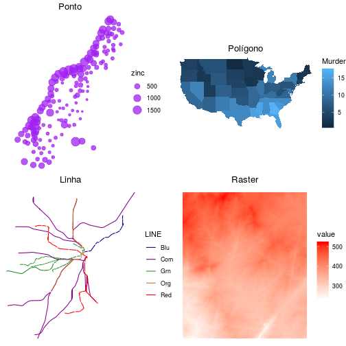

background-image: url(https://wallpapers.wallhaven.cc/wallpapers/full/wallhaven-110494.jpg)
background-size: cover

<h2 style="font-size: 97px; position: relative;top: 225px; color: white;text-shadow: -1px 0 black, 0 1px black, 1px 0 black, 0 -1px black;text-align: center;"> Visualização GeoEspacial com R </h2>

<br><br><br> 

<h2 style="font-size: 47px; position: relative;top: 300px; color: white;text-shadow: -1px 0 black, 0 1px black, 1px 0 black, 0 -1px black;text-align: center;"> Gabriel Sartori </h2>

---
# Diferentes Mapas

```{r, warning = FALSE, message = FALSE, error = FALSE, echo = FALSE, include = FALSE}
knitr::opts_chunk$set(echo = TRUE)
knitr::opts_chunk$set(fig.width = 5, fig.height = 5, comment = " ", dpi = 125, fig.align = "center")

source("xaringan_reveal.R")
source("./function/packages.R")

# opts_chunk$set(echo = FALSE, 
#               warning = FALSE, 
#               message = FALSE, 
#               error = FALSE,
#               dpi = 150,
#               fig.align = "center")
```


```{r, echo = FALSE}
# Formato numérico
number_br <-  function(x) format(x, big.mark = ".")
```


```{r, echo = FALSE}
# data set 
cwb <- readRDS("./data/cwb_regional_bairro.RDS")
# class(cwb)
terceiro <- readRDS(file = "./data/sub_terceiro.RDS")
evento <- readRDS("./data/eventbrite.RDS")
```

```{r, echo = FALSE}
# Mediana do Valor m2 
loca_tipologia_quarto <- 
  terceiro %>% 
  group_by(tipologia, bairro, quarto) %>% 
  summarise(media_locacao = median(valor))  

# filtrando  apenas dois quartos
moradia_quarto2 <-
  loca_tipologia_quarto %>% 
  filter(quarto == 2) %>% 
  ungroup() %>% 
  spread(tipologia, media_locacao) %>% 
  na.omit() %>% 
  mutate(bairro = toupper(bairro)) %>% 
  right_join(cwb, by = "bairro") 
```


```{r, out.width = "60%", echo = FALSE}

```

---
# Bibliotecas R 

<br><br>
<div class="img_center">


</div>


---
background-image: url(https://wallpapers.wallhaven.cc/wallpapers/full/wallhaven-711720.jpg)
background-size: cover

```{r, child="flip/first_ggplot2.Rmd", warning = FALSE, message = FALSE}

```

```{r, child="flip/first_map.Rmd", warning = FALSE, message = FALSE}

```

---
# Opções de Cores 

```{r, echo = FALSE}
nome_cor <-
  brewer.pal.info %>% 
  as.data.frame() %>% 
  tibble::rownames_to_column("nome_cor") %>% 
  group_by(category) %>% 
  tidyr::nest() %>% 
  mutate(data = purrr::map(.$data, ~sample_n(.x, 5)))
```

```{r, fig.width = 6, fig.height = 3}
display.brewer.all(n = 9, select = nome_cor$data[[1]]$nome_cor)
```

```{r, fig.width = 6, fig.height = 3}
display.brewer.all(n = 9, select = nome_cor$data[[2]]$nome_cor)
```

```{r, fig.width = 6, fig.height = 3}
display.brewer.all(n = 9, select = nome_cor$data[[3]]$nome_cor)
```

---
# Qual cor Escolher ?

```{r, echo = FALSE, warning = FALSE, message = FALSE, dpi = 150}

ggcores <- function(dataset, cor, titulo) {
  ggplot(data = dataset) +
    geom_sf() +
    coord_sf() + 
    aes(fill = apartamento)  +
    theme_void() +
    theme(
      panel.grid.major =  element_line(colour = "transparent"),
      plot.title = element_text(hjust = 0.5),
      legend.text = element_text(size = 11),
      legend.key.size = unit(0.55, "cm")) +
      scale_fill_gradientn(colours = brewer.pal(5, cor), na.value = "white", labels = number_br) +
    gghighlight(!is.na(apartamento), unhighlighted_params = list(colour = "gray70", fill = "gray90")) +
    labs(fill = "", title = titulo) 
    # scale_fill_continuous(labels = br)
}

mapa_seq <- ggcores(moradia_quarto2, "YlOrRd", "Sequência")
mapa_quali <- ggcores(moradia_quarto2, "Accent", "Qualitativas")
mapa_div <- ggcores(moradia_quarto2, "PiYG", "Divergente")

# g_cor <- gridExtra::grid.arrange(mapa_seq, mapa_quali, mapa_div, ncol = 3)
# ggsave(file = "./img/gg_cor.png", g_cor, width = 12, height = 6)
```

```{r, out.width = "100%", echo = FALSE, out.height = "100%"}
knitr::include_graphics('./img/gg_cor.png')
```

---
## Considerações das Cores 

---
## Escala 

```{r, echo = FALSE,  warning = FALSE, message = FALSE}

escala_quarto2 <-
  moradia_quarto2 %>%
  select(bairro, apartamento, geometry) %>%
  mutate(grp_same_size = cut_interval(apartamento, 5, dig.lab = 6)) %>%
  mutate(grp_quantile = cut_number(apartamento, 5, dig.lab = 6)) %>%
  mutate(grp_fixed = cut(apartamento, breaks = c(0, 500, 1000, 1500, 2000, 3000), dig.lab = 5))

# Legenda kmeans
legenda <- classInt::classIntervals(
  escala_quarto2$apartamento,
  n = 5,
  style = "kmeans",
  intervalClosure = "right")

legenda$brks <- legenda$brks %>% round()

escala_quarto2 <-
  escala_quarto2 %>%
  mutate(grp_kmeans = cut(apartamento, breaks = legenda$brks, include.lowest = TRUE, dig.lab = 6))

# Function to include a big mark in thousand number
convert_mark <- function(cut_variavel) {
sapply(strsplit(levels(cut_variavel), " , "), 
  function(x) 
    paste(
      prettyNum(x, 
        big.mark = ".", 
        preserve.width = "none"), 
      collapse = " - ")) %>% 
  gsub(",", "-", .)  
}


levels(escala_quarto2$grp_same_size) <- convert_mark(escala_quarto2$grp_same_size)
levels(escala_quarto2$grp_quantile) <- convert_mark(escala_quarto2$grp_quantile)
levels(escala_quarto2$grp_fixed) <- convert_mark(escala_quarto2$grp_fixed)
levels(escala_quarto2$grp_kmeans) <- convert_mark(escala_quarto2$grp_kmeans)
```


```{r, echo = FALSE, dpi = 150, warning = FALSE, message = FALSE}
nomes_escala <- c("grp_same_size", "grp_fixed", "grp_quantile", "grp_kmeans")
titulo <- c("Equal", "Fixo", "Quantil", "kmeans")
plot <- list()
for(i in 1: length(nomes_escala)){
  
  plot[[i]] <-
    escala_quarto2[, c("bairro", "apartamento", "geometry", nomes_escala[i])] %>% 
    ggplot() +
    geom_sf(aes_string(fill = nomes_escala[i])) +
    coord_sf() +
    theme_void() +
    theme(
      panel.grid.major =  element_line(colour = "transparent"),
      plot.title = element_text(hjust = 0.5),
      legend.key.size = unit(0.5, "cm"),
      legend.text = element_text(size = 11)) + 
    scale_fill_brewer(palette ="YlOrRd", na.translate = F) +
    gghighlight(!is.na(nomes_escala[i]), unhighlighted_params = list(colour = "gray70", fill = "gray90")) +
    labs(fill = "", title = titulo[i])  +
    guides(fill = guide_legend(reverse = T))
  
}

# g_escala <-  gridExtra::grid.arrange(plot[[1]], plot[[2]], plot[[3]], plot[[4]], ncol = 2)
# ggsave(file="whatever4.png", g_escala, width = 10, height = 15)

```
---

# Escala (Qual paletta descreve melhor )

```{r, out.width = "100%", echo = FALSE, out.height = "100%"}
knitr::include_graphics('./img/gg_escala.png')
```

---
# Considerações Escala

```{r, child="flip/facet_mapa.Rmd", warning = FALSE, message = FALSE}

```

background-image: url(https://wallpapers.wallhaven.cc/wallpapers/full/wallhaven-596722.jpg)
background-size: cover


```{r, child="flip/mapa_points.Rmd", warning = FALSE, message = FALSE}

```

```{r, child="flip/mapa_bg.Rmd", warning = FALSE, message = FALSE}

```


# Opções de Mapas 

+ Opções do pacote, mude o argumento `type`

```{r}
rosm::osm.types()
```

+ registrar base map

```{r, echo = TRUE}
rosm::register_tile_source(mapa_wiki = "https://maps.wikimedia.org/osm-intl/${z}/${x}/${y}.png")
```

+ Outras Opções

<a href=https://www.thunderforest.com/> thunder forest</a> <br>
<a href=https://www.xyht.com/spatial-itgis/using-openstreetmap-basemaps-qgis-3-0/> WikiMaps</a>

---
# Import Spatial Object


```{css, eval = TRUE, echo = F}
.remark-code{
  line-height: 1.25; # Espaçamento das linhas nos códigos
  font-size: 45% # tamanho da fonte nos códigos
  }
```

```{r, echo = FALSE}
# simulate 
# data <- c(rnorm(25, 2000, 500), 19, 10)) %>% as.integer()
# data <- data %>% cut(., breaks = 5, dig.lab = 4)
# levels(data)
# 
# nd_data <- data %>% prettyNum(big.mark = ".")  %>% as.factor()
# levels(nd_data)

# https://stackoverflow.com/questions/34608324/reformarring-complex-factor-vector-with-comma-separation-after-thousand
# https://www.curso-r.com/blog/2019-02-10-sf-miojo/ 

```


