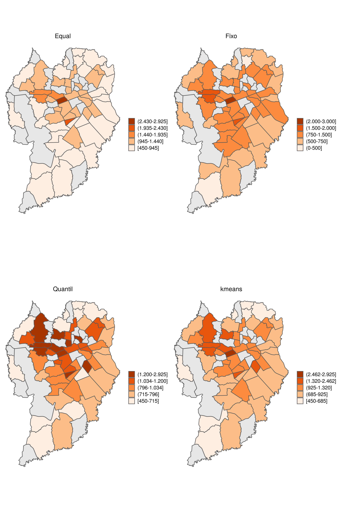

background-image: url(file:///home/gabriel/suporte/ciencia_de_dados/projeto/mapa_flipbook/img/capa_mapa.jpg)
background-size: cover

<h2 style="font-size: 97px; position: relative;top: 225px; color: white;text-shadow: -1px 0 black, 0 1px black, 1px 0 black, 0 -1px black;text-align: center;"> Visualização GeoEspacial com R </h2>

<br><br><br> 

<h2 style="font-size: 47px; position: relative;top: 300px; color: white;text-shadow: -1px 0 black, 0 1px black, 1px 0 black, 0 -1px black;text-align: center;"> Gabriel Sartori </h2>

<!-- --- -->
<!-- # Diferentes Mapas -->

```{r, warning = FALSE, message = FALSE, error = FALSE, echo = FALSE, include = FALSE}
knitr::opts_chunk$set(echo = TRUE)
knitr::opts_chunk$set(fig.width = 5, fig.height = 5, comment = " ", dpi = 130, fig.align = "center")

source("xaringan_reveal.R")
source("./function/packages.R")
```


```{r, echo = FALSE}
# Formato numérico
number_br <-  function(x) format(x, big.mark = ".")
```


```{r, echo = FALSE}
# data set 
cwb <- readRDS("./data/cwb_regional_bairro.RDS")
# class(cwb)
terceiro <- readRDS(file = "./data/sub_terceiro.RDS")
evento <- readRDS("./data/eventbrite.RDS")
```

```{r, echo = FALSE, warning = FALSE}
# Mediana do Valor m2 
loca_tipologia_quarto <- 
  terceiro %>% 
  group_by(tipologia, bairro, quarto) %>% 
  summarise(media_locacao = median(valor))  

# filtrando  apenas dois quartos
moradia_quarto2 <-
  loca_tipologia_quarto %>% 
  filter(quarto == 2) %>% 
  ungroup() %>% 
  spread(tipologia, media_locacao) %>% 
  na.omit() %>% 
  mutate(bairro = toupper(bairro)) %>% 
  right_join(cwb, by = "bairro") 
```

---
# Bibliotecas R 

<br>
<div class="img_center">

</div>
--

+ Plus 
```{r, eval = FALSE}
devtools::install_github("yutannihilation/gghighlight")
```

---
background-image: url(file:///home/gabriel/suporte/ciencia_de_dados/projeto/mapa_flipbook/img/mercado_imobiliario.jpg)
background-size: cover

```{r, child="flip/first_ggplot2.Rmd", warning = FALSE, message = FALSE}

```

```{r, child="flip/first_map.Rmd", warning = FALSE, message = FALSE}

```


---
# Qual paleta Escolher ?

```{r, echo = FALSE, warning = FALSE, message = FALSE, dpi = 150}

ggcores <- function(dataset, cor, titulo) {
  ggplot(data = dataset) +
    geom_sf() +
    coord_sf() + 
    aes(fill = apartamento)  +
    theme_void() +
    theme(
      panel.grid.major =  element_line(colour = "transparent"),
      plot.title = element_text(hjust = 0.5),
      legend.text = element_text(size = 11),
      legend.key.size = unit(0.55, "cm")) +
      scale_fill_gradientn(colours = brewer.pal(5, cor), na.value = "white", labels = number_br) +
    gghighlight(!is.na(apartamento), unhighlighted_params = list(colour = "gray70", fill = "gray90")) +
    labs(fill = "", title = titulo) 
    # scale_fill_continuous(labels = br)
}

mapa_seq <- ggcores(moradia_quarto2, "Oranges", "Sequência")
mapa_quali <- ggcores(moradia_quarto2, "Accent", "Qualitativas")
mapa_div <- ggcores(moradia_quarto2, "PiYG", "Divergente")

# g_cor <- gridExtra::grid.arrange(mapa_seq, mapa_quali, mapa_div, ncol = 3)
# ggsave(file = "./img/gg_cor.png", g_cor, width = 12, height = 6)
```

```{r, out.width = "100%", echo = FALSE, out.height = "100%"}

```

```{r, echo = FALSE}
nome_cor <-
  brewer.pal.info %>% 
  as.data.frame() %>% 
  tibble::rownames_to_column("nome_cor") %>% 
  group_by(category) %>% 
  tidyr::nest() %>% 
  mutate(data = purrr::map(.$data, ~sample_n(.x, 3)))
```


---
# Paleta Sequencial

+ Adequado para variáveis numérica que mantém um mesmo matriz de cor, apenas com incrementos de brilho, do mais claro para o mais escuro, que indicam o quão menor ou maior é o valor.

+ Exemplo: Indicadores de Saúde, Segurança

```{r, fig.width = 7, fig.height = 3, echo = FALSE, dpi = 100}
display.brewer.all(n = 9, select = nome_cor$data[[3]]$nome_cor)
```

+ Pacote `RColorBrewer`, veja todas as opções em `display.brewer.all()`

---
# Divergente


+ Indicado para valores que refletem a natureza de duas posições extremas

+ Adequado para variáveis em que o valor central é neutro, ou represente equilíbrio entre duas partes

+ Exemplo: Correlação Pearson [-1; 1]; Razão entre as ideologias políticas


```{r, fig.width = 6, fig.height = 3, echo = FALSE, dpi = 100}
display.brewer.all(n = 9, select = nome_cor$data[[1]]$nome_cor)
```

---
# Paleta Qualitativa

+ Adequado para variáveis categóricas na qual deseja distingui-las

+ Não é adequado usar para representar variáveis numéricas

+ Exemplo: Partido político de cada município


```{r, fig.width = 6, fig.height = 3, echo = FALSE, dpi = 100}
display.brewer.all(n = 7, select = nome_cor$data[[2]]$nome_cor)
```


<!-- --- -->
<!-- ## Escala  -->

```{r, echo = FALSE,  warning = FALSE, message = FALSE}

escala_quarto2 <-
  moradia_quarto2 %>%
  select(bairro, apartamento, geometry) %>%
  mutate(grp_same_size = cut_interval(apartamento, 5, dig.lab = 6)) %>%
  mutate(grp_quantile = cut_number(apartamento, 5, dig.lab = 6)) %>%
  mutate(grp_fixed = cut(apartamento, breaks = c(0, 500, 750, 1500, 2000, 3000), dig.lab = 5))

# Legenda kmeans
legenda <- classInt::classIntervals(
  escala_quarto2$apartamento,
  n = 5,
  style = "kmeans",
  intervalClosure = "right")

legenda$brks <- legenda$brks %>% round()

escala_quarto2 <-
  escala_quarto2 %>%
  mutate(grp_kmeans = cut(apartamento, breaks = legenda$brks, include.lowest = TRUE, dig.lab = 6))

# Function to include a big mark in thousand number
convert_mark <- function(cut_variavel) {
  sapply(strsplit(levels(cut_variavel), " , "), 
         function(x) 
           paste(
             prettyNum(x, 
                       big.mark = ".", 
                       preserve.width = "none"), 
             collapse = " - ")) %>% 
    gsub(",", "-", .)  
}


levels(escala_quarto2$grp_same_size) <- convert_mark(escala_quarto2$grp_same_size)
levels(escala_quarto2$grp_quantile) <- convert_mark(escala_quarto2$grp_quantile)
levels(escala_quarto2$grp_fixed) <- convert_mark(escala_quarto2$grp_fixed)
levels(escala_quarto2$grp_kmeans) <- convert_mark(escala_quarto2$grp_kmeans)
```


```{r, echo = FALSE, dpi = 150, warning = FALSE, message = FALSE}
nomes_escala <- c("grp_same_size", "grp_fixed", "grp_quantile", "grp_kmeans")
titulo <- c("Equal", "Fixo", "Quantil", "kmeans")
plot <- list()
for(i in 1: length(nomes_escala)){
  
  plot[[i]] <-
    escala_quarto2[, c("bairro", "apartamento", "geometry", nomes_escala[i])] %>% 
    ggplot() +
    geom_sf(aes_string(fill = nomes_escala[i])) +
    coord_sf() +
    theme_void() +
    theme(
      panel.grid.major =  element_line(colour = "transparent"),
      plot.title = element_text(hjust = 0.5),
      legend.key.size = unit(0.5, "cm"),
      legend.text = element_text(size = 11)) + 
    scale_fill_brewer(palette ="Oranges", na.translate = F) +
    gghighlight(!is.na(nomes_escala[i]), unhighlighted_params = list(colour = "gray70", fill = "gray90")) +
    labs(fill = "", title = titulo[i])  +
    guides(fill = guide_legend(reverse = T))
  
}

# g_escala <-  gridExtra::grid.arrange(plot[[1]], plot[[2]], plot[[3]], plot[[4]], ncol = 2)
# ggsave(file="whatever4.png", g_escala, width = 10, height = 15)
```
---
# Escala (Qual paletta descreve melhor )

```{r, out.width = "100%", echo = FALSE, out.height = "100%"}

```

---
# Distribuição dos grupos por Escala

```{r,  echo = FALSE, dpi = 150, warning = FALSE, message = FALSE}
n_escala <- function(.data, group_col) {
.data %>% 
  dplyr::group_by(!!rlang::ensym(group_col)) %>% 
  na.omit() %>%
  count()
} 

gg_escala <- function(dados, group_n, n, titulo) { 
  ggplot(data = dados, aes_string(x = group_n, y =  n, fill = group_n)) +
    geom_bar(stat = 'identity', colour = "gray25") +
    scale_fill_brewer(palette = "Oranges") +
    geom_text(aes_string(label = n), vjust = "inward", hjust = 0.5, colour = "gray25") +
    guides(fill = FALSE) +
    labs(x = "", y = "Bairros", title = titulo) +
    theme_bw() +
    theme(axis.text.x = element_text(face = 'bold', size = 10),
          plot.title  = element_text(hjust = 0.5))
    
}
```

```{r, echo = FALSE, eval = FALSE, warning = FALSE, message = FALSE}
equal <- 
  n_escala(escala_quarto2, "grp_same_size")  %>% 
  gg_escala(., "grp_same_size", "n", "Escala Equal")

fixa <- 
  n_escala(escala_quarto2, "grp_fixed")  %>% 
  gg_escala(., "grp_fixed", "n", "Escala Fixa")

quantil <- 
  n_escala(escala_quarto2, "grp_quantile")  %>% 
  gg_escala(., "grp_quantile", "n", "Escala Quantil")

kmeans <- 
  n_escala(escala_quarto2, "grp_kmeans")  %>% 
  gg_escala(., "grp_kmeans", "n", "Escala Kmeans")

g_bar_escala <-  gridExtra::grid.arrange(equal, fixa, quantil, kmeans, ncol = 2)
ggsave(file = "./img/grupos_escala.png", g_bar_escala, width = 13, height = 7)
```


```{r, out.width = "100%", echo = FALSE, out.height = "100%"}

```

---
# Considerações Escala

+ Definir escalas, consiste em criar grupos distintos  

+ Prefira escalas que remetam a interpretações práticas dos grupos

+ As escalas quantílicas e kmeans, ou qualquer método de agrupamento são critérios estatísticos

+ Na dúvida, ou sem uma escala pré-existente da área, exponha diferentes escalas que podem ser feitas

+ Número impar de grupos, sugere que o grupo intermediário tenha uma interpretação neutra


```{r, child="flip/facet_mapa.Rmd", warning = FALSE, message = FALSE}

```

background-image: url(file:///home/gabriel/suporte/ciencia_de_dados/projeto/mapa_flipbook/img/evento.jpg)
background-size: cover


```{r, child="flip/mapa_points.Rmd", warning = FALSE, message = FALSE, eval = TRUE}

```

# Basemaps

```{r, out.width = "85%", echo = FALSE, out.height = "90%"}

```


```{r, child="flip/mapa_bg.Rmd", warning = FALSE, message = FALSE, eval = TRUE}

```


# Opções de Mapas 

+ Opções do pacote, mude o argumento `type` da função `annotation_map_tile`

```{r}
rosm::osm.types() # Alguns precisam de api
```

+ registrar base map

```{r, echo = TRUE}
rosm::register_tile_source(mapa_wiki = "https://maps.wikimedia.org/osm-intl/${z}/${x}/${y}.png")
```

+ Sites que disponibilizam basemaps

<a href= http://leaflet-extras.github.io/leaflet-providers/preview/index.html/> leaflet </a> <br>
<a href=https://www.thunderforest.com/> thunder forest</a> <br>
<a href=https://www.xyht.com/spatial-itgis/using-openstreetmap-basemaps-qgis-3-0/> WikiMaps</a>

---
# Leitura Objeto Espacial

<br>
<div class="img_center">

</div>

---
# Formatos Geográficos

<br>


---
## Ênfase

<br>


---
# Shapefile e Geojson

*Shapefile*
+ .shp; .shx; .dbf  (devem estar na mesma pasta)
+ .prj - opcional

```{r, eval = FALSE}
require(sf)
cwb <- read_sf(
  dsn = "/home/gabriel/suporte/ciencia_de_dados/base_de_dado/ipppuc/bairro_sirgas", # caminho do arquivo
  layer = "DIVISA_DE_BAIRROS") # nome do arquivo
```

--
*Geojson*
+ .geojson

```{r}
require(geojsonsf)
cwb <- geojson_sf("https://raw.githubusercontent.com/gustavokira/geo-curitiba/master/json/bairros.geo.json")
```

---
# Resultado

```{r}
cwb
```

---
# Bases de Dados Espaciais

<br> 
**Explore as bases de dados espaciais**

+ [IPPUC][ippuc]
+ [estados do Brasil][brasil-geojson]
+ [Instituto de Terras, Cartografia e Geologia do Paraná][itcg]
+ [data-gov][data-energy]
+ [EUA][data-gov]
+ [energia][data-energy]
+ [World Resource Institute][world-resource-institute]

---
# Criando Objeto Espacial

<br> 

+ Vamos considerar que você recebeu um conjunto de latitude e longitude (ponto) e deseja transformar em objeto espacial!
+ Dados de Monitoramento de Qualidade da água em Curitiba 

```{r,  warning = FALSE, message = FALSE, eval = TRUE, echo = FALSE}
file_lat_long <- "/home/gabriel/suporte/ciencia_de_dados/base_de_dado/qualidade_agua/geo_iqa_metadado.xlsx"
# readr::read_delim(file = file_lat_long)
geo_iqa <- readxl::read_xlsx(path = file_lat_long, sheet = 1)

# filtrar curitiba
geo_iqa_cwb <- geo_iqa %>% 
  filter(munic == "Curitiba")

qualidade_agua <- 
  geo_iqa_cwb %>% 
  select(lat.sirgas2000, long.sirgas2000) %>% 
  mutate_all(funs(gsub(",", ".",.))) %>% 
  mutate_if(is.character, as.numeric) %>% 
  cbind(geo_iqa_cwb$id, geo_iqa_cwb$ph) %>% as_tibble() %>% 
  plyr::rename(c("lat.sirgas2000" = "latitude",
                 "long.sirgas2000" = "longitude", 
                 "geo_iqa_cwb$id" = "id_estacao",
                 "geo_iqa_cwb$ph" = "ph")) %>% 
  select(id_estacao, ph, latitude, longitude) %>% 
  mutate(id_estacao = as.character(id_estacao))

qualidade_agua %>% head() %>% 
  glimpse()
```

+ Formato do Dado

```{r}
qualidade_agua %>% class()
```

--
+ *Se você tentar um plot.. vai acontecer isso*

---

```{r, echo = TRUE, dpi = 150, fig.width = 6, fig.height = 4}
plot(qualidade_agua)
```

---
# Transformando em objeto espacial

```{r, echo = TRUE}
sf_qualidade_agua <- 
  sf::st_as_sf(x = qualidade_agua, # base de dados
              coords = c("longitude", "latitude"),  # Variáveis espaciais
              agr = "identity", # Atributo identidade
              crs = 4326)   # Sistema de referência geografica
```

+ Formato do Dado

```{r}
sf_qualidade_agua %>% head(n = 1)
```

+  <a href = "https://bookdown.org/robinlovelace/geocompr/spatial-class.html#crs-intro"> detalhes crs </a>


```{r, child="flip/mapa_qualidade.Rmd", warning = FALSE, message = FALSE, eval = TRUE}

```


# Referência

<a href="https://geocompr.robinlovelace.net/">

</a>

---
# Agradecimentos

<br>

+ Daniel Ruffasto, scrapping dos eventos no site Evertbrite

+ Equipe MAPI

---
# Contato

<br>

+ gsartorik@gmail.com

+ [gsartorik.com][site-pessoal]

+ Todo material está disponível em no [github][github-gabriel]


```{css, eval = TRUE, echo = F}
.remark-code{
  line-height: 1.25; # Espaçamento das linhas nos códigos
  font-size: 45% # tamanho da fonte nos códigos
  }
```

```{r, echo = FALSE}
# simulate 
# data <- c(rnorm(25, 2000, 500), 19, 10)) %>% as.integer()
# data <- data %>% cut(., breaks = 5, dig.lab = 4)
# levels(data)
# 
# nd_data <- data %>% prettyNum(big.mark = ".")  %>% as.factor()
# levels(nd_data)

# https://stackoverflow.com/questions/34608324/reformarring-complex-factor-vector-with-comma-separation-after-thousand
# https://www.curso-r.com/blog/2019-02-10-sf-miojo/ 

```


[ippuc]: http://ippuc.org.br/geodownloads/geo.htm
[brasil-geojson]: https://github.com/tbrugz/geodata-br
[data-gov]: https://catalog.data.gov/organization/01ca8df8-6248-41e6-baa2-8b682e4b5a08?res_format=SHP&_res_format_limit=0
[data-energy]: https://energydata.info/dataset?res_format=GeoJSON&page=1
[data-gov]: http://dados.gov.br/dataset?res_format=ZIP+SHP&_res_format_limit=0
[itcg]: http://www.itcg.pr.gov.br/modules/faq/category.php?categoryid=9#
[world-resource-institute]: http://datasets.wri.org/dataset?q=Forests&res_format=GeoJSON
[site-pessoal]: https://gsartorik.com/pt/
[github-gabriel]: https://github.com/GabrielSartori/mapa_flipbook
<!-- https://geocompr.robinlovelace.net/images/cover.png -->
